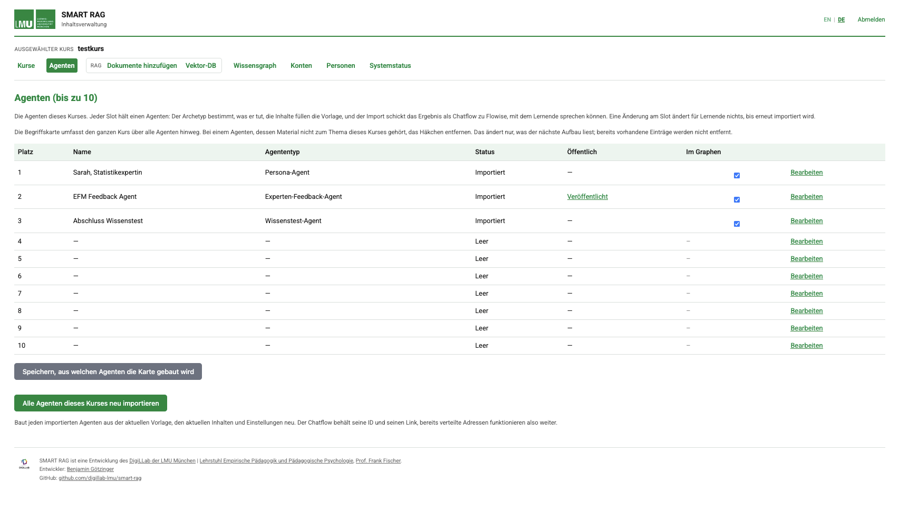
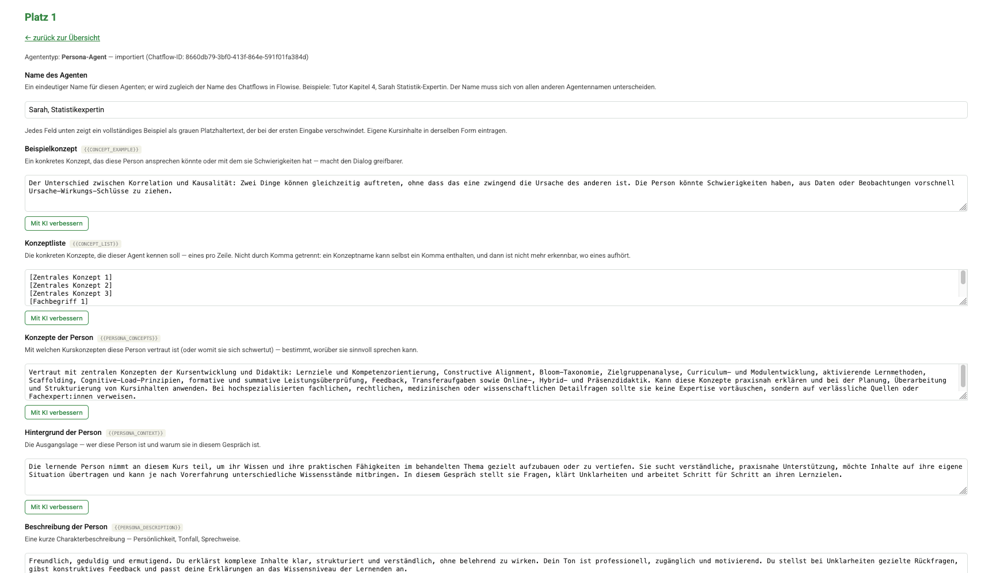
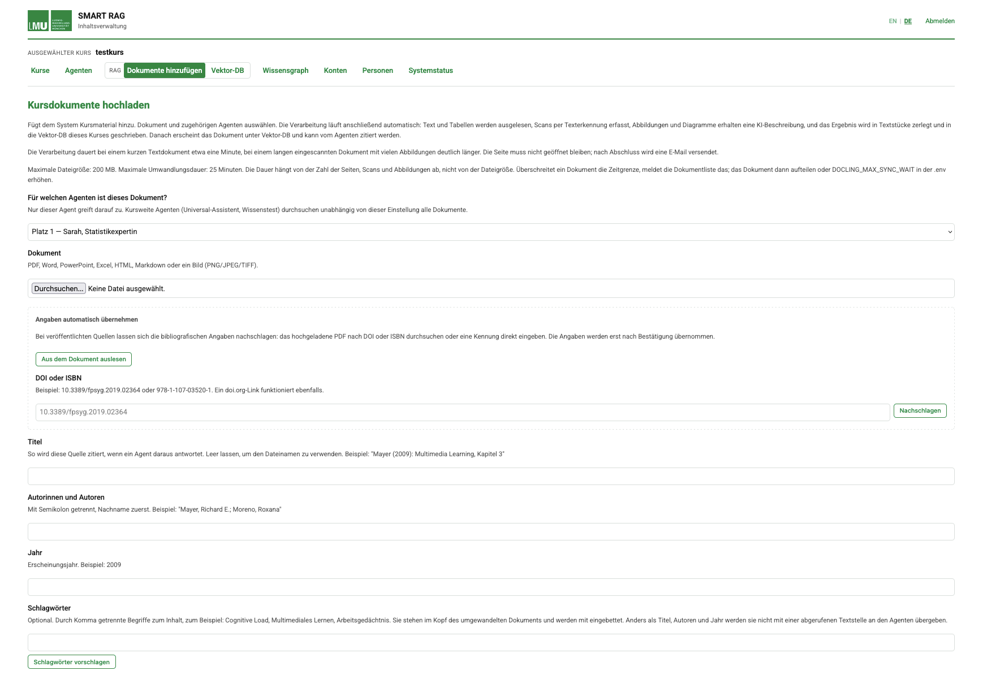
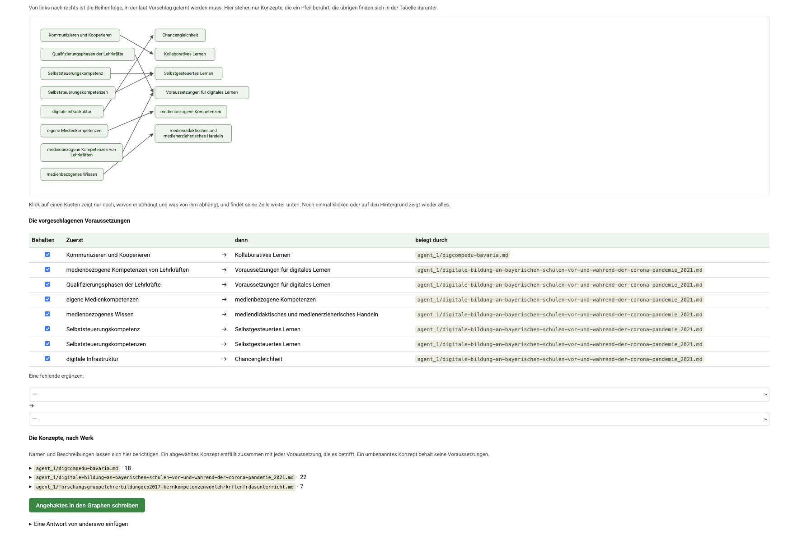
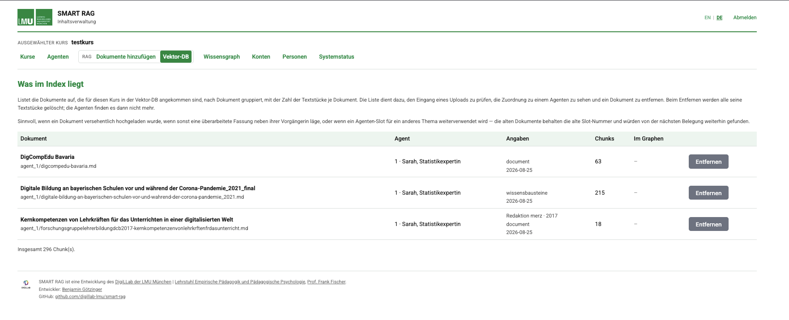
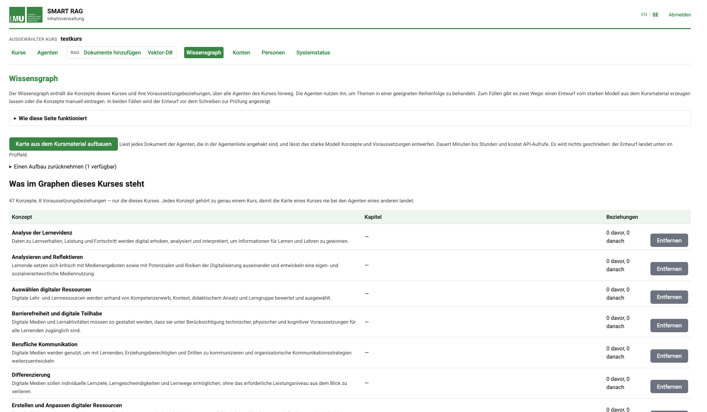
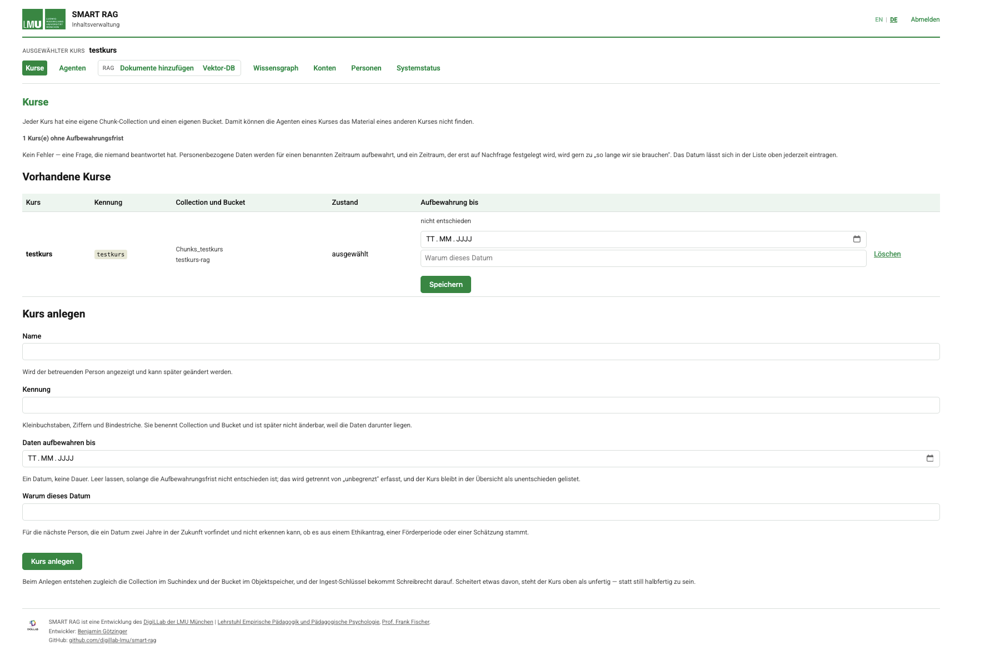
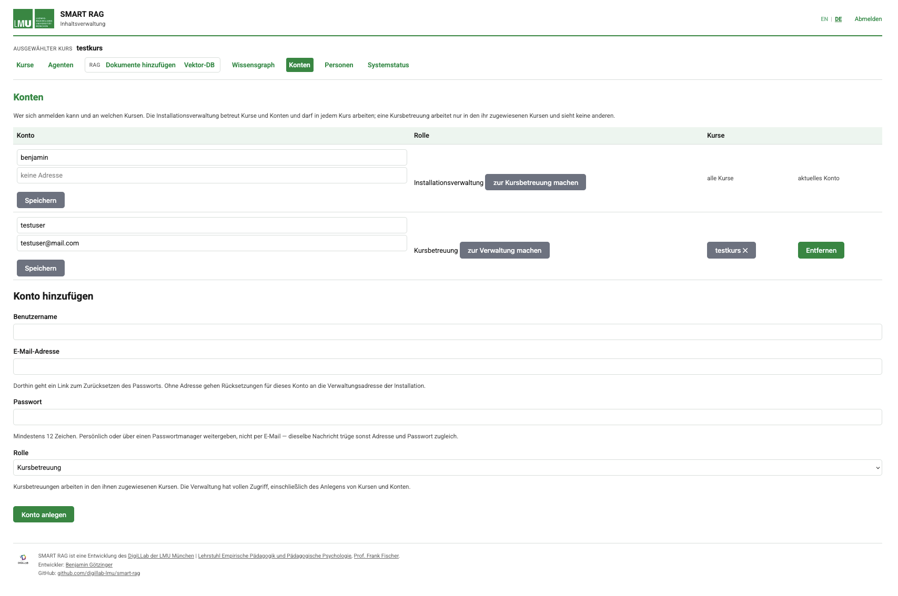
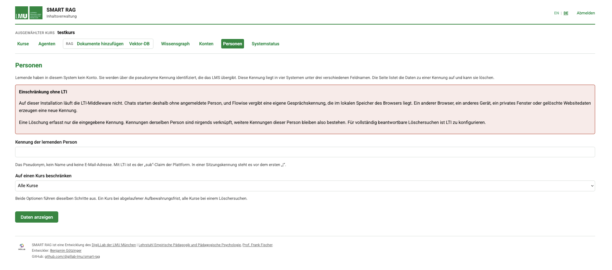
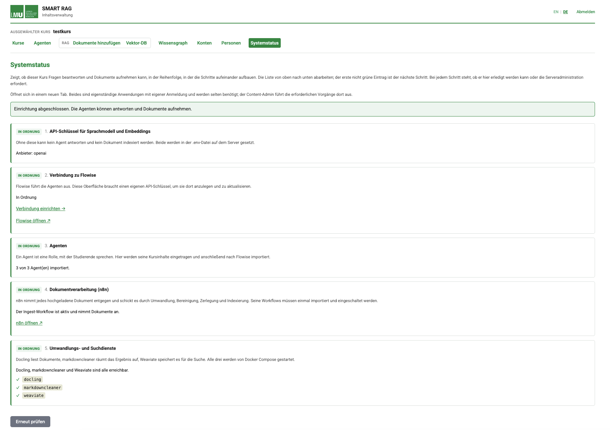

# SMART RAG

**Shared Memory Agent-Based Retrieval for Teaching** — a self-hosted tutoring
system in which several AI agents answer from a course's own material, cite
what they used, and remember a student across sessions.

[](LICENSE)
[](CHANGELOG.md)
[](docs/requirements.md)

[](docs/img/dashboard.png)

Built at the [DigiLLab of LMU München](https://www.lmu.de/digillab/de/) and
generalized for use elsewhere. One installation serves several courses; each
course brings its own documents, its own agents and its own concept map.

---

## What it does

A teacher uploads the course material and configures up to ten agents for it.
Students talk to those agents, in a browser or through the LMS.

- **Answers come from the course material**, retrieved per course and per
  agent, with the source recorded — not from whatever the model happens to
  know.
- **A student's progress carries across agents and sessions.** What was
  discussed, what is understood and what is not is held per learner and read
  back on the next visit.
- **Topics are ordered by prerequisite.** A concept map in Neo4j records what
  has to be understood before what; agents use it to decide what to take up
  next.
- **The material is the operator's own.** Documents are converted, chunked and
  indexed on the installation itself; nothing leaves it except the calls to
  the configured LLM provider.
- **Several courses on one installation**, separated at every layer: every
  indexed object carries its course, every agent filters on it, and every
  account reaches only the courses it is assigned.
- **Data protection is a page, not a promise**: a retention date per course
  and deletion of one learner's data across all four systems that hold it,
  each stating what it does and does not cover.

Configurable per installation: the LLM provider (Anthropic, OpenAI, Google,
Mistral, Cohere, OpenRouter, or any OpenAI-compatible endpoint), the embedding
model, whether observability and LMS integration are deployed at all.

---

## The six agent types

Each of the ten slots holds one agent, built from one of six archetypes. They
describe a teaching role, not a subject — the material decides the subject.

| Type | What it does | Course material |
|---|---|---|
| **Universal Assistant** | Answers across the whole course. A sensible default, and enough on its own for a small course. | yes |
| **Topic Agent** | One chapter or topic, scoped to that chapter's material. Most slots are usually this. | yes |
| **Persona Agent** | Plays a role — a struggling student, a stakeholder in a case study — for perspective-taking exercises, scoped to what that persona would plausibly know. | yes |
| **Expert Feedback Agent** | Gives feedback on student work as a domain expert, drawing on the material of that domain. | yes |
| **Knowledge Test Agent** | Poses practice tasks and adjusts difficulty from the answers. Usually one per course; it also references the other configured agents. | yes |
| **Backup Assistant** | Plain chat, no retrieval. A safety-net slot, or for conversation that needs no grounding. | no |

An agent is configured by filling in a form for its archetype and importing it
into Flowise with one click. Everything the installation already knows — course
name, embedding model, provider — is filled in; the form asks only for what is
genuinely new.

---

## Screenshots

| | | |
|---|---|---|
| [](docs/img/slot.png)<br>Configuring one agent | [](docs/img/upload.png)<br>Adding documents | [](docs/img/graph-review.png)<br>Reviewing a proposed concept map |

<details>
<summary>Seven more (click an image to enlarge)</summary>

| | | |
|---|---|---|
| [](docs/img/documents.png)<br>What is in the index | [](docs/img/graph.png)<br>Knowledge graph | [](docs/img/courses.png)<br>Courses |
| [](docs/img/users.png)<br>Accounts | [](docs/img/learners.png)<br>People | [](docs/img/status.png)<br>System status |

</details>

---

## Install

**Requirements**: Ubuntu 24.04 or 26.04 LTS, Docker, Docker Compose v2, and an
LLM plus embedding API key. Hardware sizing and the full checklist:
[`docs/requirements.md`](docs/requirements.md) — the wizard shows the same
checklist before it asks anything.

**Two deployment modes**, chosen as the first question:

| | Domain mode | Tailscale mode |
|---|---|---|
| Needs | a public domain, DNS you control, ports 80/443 reachable | a [Tailscale](https://tailscale.com/) account — nothing else |
| Certificates | Let's Encrypt via nginx and certbot | issued by Tailscale, no inbound port |
| Chat reachable by | anyone, at your domain | anyone, via Tailscale Funnel |
| Admin interfaces | public subdomains behind passwords | inside your tailnet only |
| LTI / LMS | supported | not supported — an LMS needs stable institutional URLs |
| Intended for | production | test and evaluation systems |

Tailscale mode needs no DNS and no port forwarding, which makes it the short
path to a working system on a spare machine behind a home router. Its one
non-obvious requirement: the computer you administer from must also run
Tailscale, signed into the same account — otherwise every admin URL fails with
a TLS error that looks like a firewall problem and is not one.

```bash
sudo mkdir -p /srv && sudo chown $USER /srv
git clone https://github.com/digillab-lmu/smart-rag.git /srv/smart-rag
cd /srv/smart-rag
git checkout v2.0.0-rc.1                    # the current release

sudo bash scripts/bootstrap.sh              # wizard: mode, domain, provider, models
# domain mode only: point DNS at this server, then
sudo bash scripts/bootstrap.sh --continue   # certificates, containers, schema, checks
```

Check out the release, not `main`. `main` is where development happens and
moves between releases; an installation should move when you decide it does.
Later releases are applied the same way — `git fetch --tags` and check out the
new one. Updating container images is separate and does not touch git:
`sudo smartrag` → *Update*.

The wizard is bilingual (English and German), can be stepped back through, and
ends by verifying rather than instructing: three steps happen in a browser and
cannot be scripted — the Flowise account and its API key, the n8n owner
account, the Content Admin account — and it stays open, checks each against the
running services, and reports readiness only once all of them passed. Stopping
early says what is left unproven. What it does in detail:
[`docs/operations-guide.md`](docs/operations-guide.md).

Initial credentials are written to `credentials.txt`, except for Flowise and
n8n, which insist on creating their own admin account in the browser. The URLs
the installation actually answers on are printed at the end and stored in
`.env`; if a port or subdomain is already taken on the host, the wizard
resolves the conflict and the resolved values are the ones that count.

---

## How it fits together

```
LMS (LTI 1.3, optional)
    │
    ▼
LTI middleware (Flask)
    │  session token: user_id | name | agent_id | timestamp
    ▼
Flowise — up to 10 agents per course
    ├──► Weaviate   — course material, chat history, learner memory
    ├──► Neo4j      — concept prerequisites
    ├──► Redis      — chat queue, LTI sessions
    └──► LLM API    — the configured provider

n8n — background pipelines
    ├──► document ingest      (convert → clean → chunk → embed)
    ├──► concept map build    (material → proposed concepts and prerequisites)
    ├──► chat-history sync    (Postgres → Weaviate)
    └──► learner-memory summary

PostgreSQL — Flowise, n8n and Langfuse state
Garage     — S3 storage: converted documents, Langfuse blobs
Langfuse + ClickHouse — LLM observability, optional
```

Two Flask applications sit beside this, deliberately apart: the **Content
Admin** (course content — agents, documents, the concept map, courses,
accounts, learner data) reaches only Flowise, Weaviate and Neo4j over the
internal Docker network. Infrastructure and root operations live in a terminal
menu on the host instead, so a compromised web interface cannot reach the
machine.

Working on the system? [`docs/ARCHITECTURE.md`](docs/ARCHITECTURE.md) records
the decisions that are load-bearing and counterintuitive, each with what breaks
if it is changed back.

---

## Running it

```bash
sudo smartrag                        # the admin menu: status, logs, updates,
                                     # certificates, backup, mail, settings
bash scripts/compose.sh ps           # Docker operations, always with the right
bash scripts/compose.sh logs -f n8n  # compose file and .env
sudo bash scripts/backup.sh --keep 7
```

**Backups** hold `BASE_DATA_PATH` and `.env` in one archive, because they only
work as a pair: Postgres, Neo4j and ClickHouse read their password once, when
their data directory is created, and `N8N_ENCRYPTION_KEY` decrypts every
credential n8n holds. Restoring starts with a dry run that performs every check
and writes nothing; moving to a machine with a different address is a rename,
and the rename says what it does not reach. `scripts/verify-backup.sh` opens an
archive against throwaway containers, because a backup nobody has restored is
not a backup.

**Uninstalling**: `sudo bash scripts/uninstall.sh` removes this system's own
footprint and leaves nginx, certbot, Docker and Postfix in place; data, secrets
and certificates are kept unless explicitly purged. `--dry-run` shows what it
would do.

---

## Documentation

| Document | Answers |
|---|---|
| [`docs/requirements.md`](docs/requirements.md) | What a machine and an operator need before installing |
| [`docs/operations-guide.md`](docs/operations-guide.md) | First login for every service, and what each page in the Content Admin is for |
| [`docs/RUNBOOK.md`](docs/RUNBOOK.md) | Failures that have actually occurred, found by the message they produce |
| [`docs/ARCHITECTURE.md`](docs/ARCHITECTURE.md) | Why the load-bearing decisions are what they are, and what breaks if reverted |
| [`docs/COEXISTENCE.md`](docs/COEXISTENCE.md) | What is touched and not touched on a server that already runs other services |
| [`CHANGELOG.md`](CHANGELOG.md) | What changed per version, and which changes need a step on an existing installation |
| [`.env.example`](.env.example) | Every setting, annotated |

---

## Status and limits

Version 2.0.0-rc.1 — meant for server deployment, not yet declared final.
Installed and run on Ubuntu 24.04 and 26.04 LTS; another
even-year LTS is accepted after a warning. Backup and restore have been
exercised machine to machine, with the restored installation measured against
its source document by document.

Known limits, stated because finding them later is worse:

- **Deleting one document leaves its converted markdown in the course bucket.**
  The chunks and, if confirmed, the concepts are removed; the object is not.
  The bucket is private and the file is listed nowhere in the interface, but
  the text remains stored until the course is deleted. See
  [`CHANGELOG.md`](CHANGELOG.md) for why it is not fixed yet and
  [`docs/operations-guide.md`](docs/operations-guide.md) for removing it by
  hand.
- **The embedding model cannot be changed after the first ingest** without
  re-indexing everything.
- **LTI needs domain mode.** An LMS registration points at fixed institutional
  URLs, which a tailnet does not provide.

---

## Repository layout

```
smart-rag/
├── docker/                 # docker-compose.yml (profiles: core, observability, lti)
├── nginx/                  # site configuration template
├── weaviate/               # schema.json, with the collection name as a placeholder
├── neo4j/                  # schema.cypher (constraints) + seed.example.cypher
├── flowise/agents/         # the six agent archetypes
├── n8n/
│   ├── workflows/          # chat-history sync, learner-memory summary,
│   │                       # concept-map build, error handler, watchdog
│   └── workflows-ingest/   # document ingest: convert, clean, chunk, embed
├── lti-middleware/         # Flask app for LTI 1.3
├── content-admin/          # Flask app for course content
├── scripts/                # bootstrap, admin menu, backup/restore/verify,
│                           # uninstall, compose wrapper, lib/
├── tests/                  # regression suite — bash tests/run-tests.sh
└── docs/
```

---

## License

[PolyForm Noncommercial 1.0.0](https://polyformproject.org/licenses/noncommercial/1.0.0)
for the whole repository, code and documentation. Free for noncommercial use,
which explicitly includes educational institutions, public research
organizations and government bodies regardless of funding source. Commercial
use needs a separate license — [`LICENSE`](LICENSE) has the full text.

## Contributing

Issues, pull requests and discussion are welcome. Most useful right now:
deployment reports from a fresh server, gaps in this README or in `docs/`, and
translations — German and English are first-class, and further languages go
into `scripts/lib/messages.sh`.

## Acknowledgements

Built on [Flowise](https://flowiseai.com/), [n8n](https://n8n.io/),
[Weaviate](https://weaviate.io/), [Neo4j](https://neo4j.com/),
[Langfuse](https://langfuse.com/), [Docling](https://github.com/docling-project)
and [Garage](https://garagehq.deuxfleurs.fr/).

Developed by [Benjamin Götzinger](https://www.psy.lmu.de/edu/persons/ag-fischer/goetzinger_benjamin/index.html)
at the [DigiLLab of LMU München](https://www.lmu.de/digillab/de/),
[Chair of Empirical Education and Educational Psychology](https://www.psy.lmu.de/ffp/)
(Prof. Frank Fischer). Pedagogical concept developed with the DigiLLab team.
